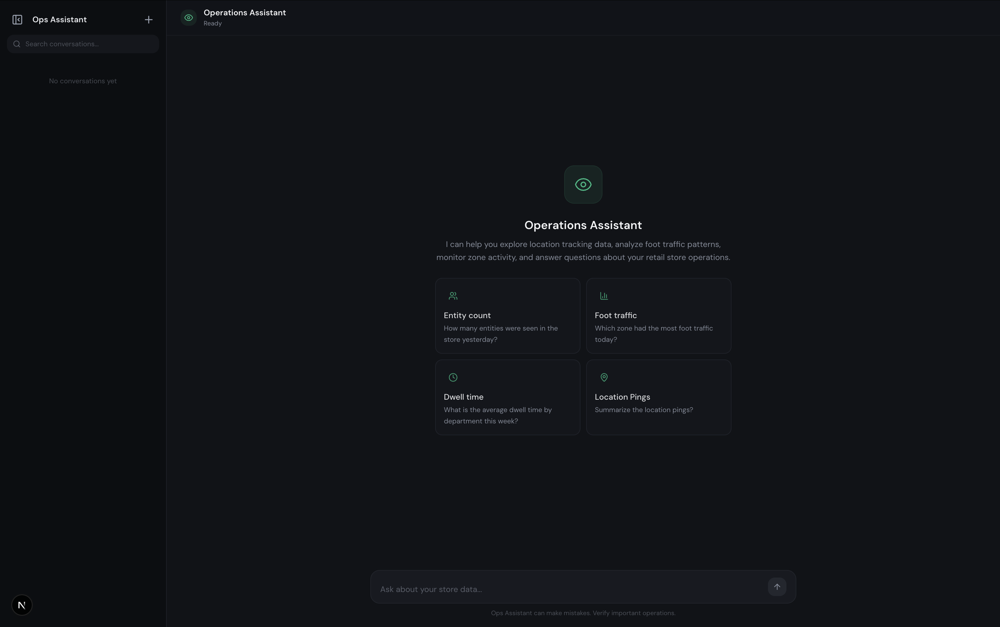

# Ops Assistant

An AI-powered chatbot for querying an indoor location-tracking database. The assistant uses OpenAI function calling to translate natural-language questions into SQL, execute them against a read-only SQLite database, and return clear, conversational answers.



---

## Key Features

### OpenAI Function-Calling Chatbot
The core of the project. GPT-4o-mini receives the database schema as a tool definition and autonomously decides when to query the database to answer a user's question. Multi-turn tool-call loops are supported so the model can issue follow-up queries when needed.

### SQL Query Generation and Execution
Rather than relying on a fixed set of canned queries, the model generates arbitrary `SELECT` statements at runtime. This means it can answer questions it has never seen before -- from simple counts to complex joins and time-windowed aggregations.

### Time-Context-Aware Queries
The system prompt is injected with the current date and time at conversation creation. This allows the model to resolve relative time references like *"last hour"*, *"today"*, or *"this week"* into correct SQL `WHERE` clauses without any extra logic.

### Read-Only Query Safety
Every query passes through a five-step validation pipeline before it reaches the database:
1. Non-empty check
2. `SELECT`-only enforcement
3. Semicolon rejection (no statement stacking)
4. Blocked keyword scan (`INSERT`, `DROP`, `ALTER`, etc.)
5. SQL comment rejection (`--` and `/*`)

The database connection itself is also opened in read-only mode at the driver level.

### Conversation Management
Full CRUD support for conversations. Each conversation maintains its own message history, tool-call records, and timestamps -- enabling multi-turn interactions and history retrieval.

### API Key Authentication
All API endpoints (except the health check) require a Bearer token. Valid keys are configured via an environment variable, making it simple to provision and rotate access.

### Per-Key Sliding-Window Rate Limiting
The chat endpoint is rate-limited per API key using an in-memory sliding window (default: 20 requests/hour). Standard `X-RateLimit-*` headers are returned on every chat response so clients can display remaining quota.

### Streaming Responses (SSE)
The chat endpoint has a streaming variant that delivers tokens in real time via Server-Sent Events. Clients receive granular events -- `status`, `reasoning_token`, `reasoning`, `tool_call`, `tool_result`, `token`, `done`, and `error` -- so the UI can show progress indicators, live SQL queries, reasoning traces, and incremental text as the model generates it.

### Web UI (Next.js)
A modern chat interface with conversation sidebar, streaming responses, and live SQL query panels. The UI connects to the FastAPI backend via SSE and authenticates using the same API key used by other clients.

### Full REST API
A FastAPI server exposes conversation CRUD, chat (with both synchronous and streaming modes), rate-limit status, and a health check. Interactive Swagger documentation is auto-generated at `/docs`.

### CLI Interface
An interactive terminal REPL for quick testing. It connects directly to the core chatbot library, prints executed SQL queries in real time, and requires no server setup.

### Mock Data Generator
A standalone script that creates a realistic SQLite database with zones, entities, location pings, and derived zone events. Useful for demos and development.

---

## Project Structure

```
ops-assistant/
├── packages/
│   ├── core/                  # Shared chatbot and database library
│   │   └── src/
│   │       ├── chatbot/
│   │       │   ├── ChatBot.py          # Orchestrates OpenAI completions + tool calls
│   │       │   ├── models.py           # Conversation, Message, ToolCallRecord
│   │       │   ├── prompts.py          # Time-aware system prompt
│   │       │   └── tools.py            # OpenAI tool definitions (execute_sql_query)
│   │       └── database/
│   │           ├── DatabaseProvider.py  # Read-only SQLite connection
│   │           ├── QueryExecutor.py    # 5-step query validation + execution
│   │           └── schema.py           # DDL for the location-tracking schema
│   │
│   ├── api/                   # FastAPI REST server
│   │   ├── api/
│   │   │   ├── main.py        # App entry point, lifespan, CORS
│   │   │   ├── routes.py      # Endpoint handlers
│   │   │   ├── auth.py        # Bearer token authentication
│   │   │   ├── rate_limit.py  # Sliding-window rate limiter
│   │   │   └── schemas.py     # Pydantic request/response models
│   │   └── API.md             # Complete API documentation
│   │
│   └── cli/                   # Interactive terminal client
│       └── cli/
│           └── main.py        # REPL loop
│
├── packages/web/              # Next.js web UI
│   ├── app/                   # App router pages
│   ├── components/            # UI + chat components
│   ├── hooks/                 # SSE chat hook
│   ├── lib/                   # API client + shared types
│   └── example.env            # Web env template
│
├── scripts/
│   └── generate_mock_data.py  # Creates a populated SQLite database
│
├── example.env                # Environment variable template
└── pyproject.toml             # uv workspace configuration
```

---

## Quick Start

### Prerequisites

- Python 3.14+
- [uv](https://docs.astral.sh/uv/) package manager
- An OpenAI API key

### 1. Clone and install

```bash
git clone <repo-url>
cd ops-assistant
uv sync
```

### 2. Configure environment

```bash
cp example.env .env
```

Edit `.env` and set at minimum:

| Variable | Description |
|---|---|
| `DB_PATH` | Path to the SQLite database (e.g. `data/mock.db`) |
| `OPENAI_API_KEY` | Your OpenAI API key |
| `API_KEYS` | Comma-separated keys for API authentication |

To change the API bind host or port, set:

| Variable | Description | Default |
|---|---|---|
| `API_HOST` | Host interface for the API server | `0.0.0.0` |
| `API_PORT` | Port for the API server | `3000` |

### 3. Generate mock data

```bash
uv run python scripts/generate_mock_data.py
```

This creates a SQLite database at the configured `DB_PATH` with realistic indoor location data.

### 4. Run the CLI

```bash
uv run ops-cli
```

### 5. Run the API server

```bash
uv run ops-api
```

The server starts on `http://localhost:3000` by default. Interactive docs are at `http://localhost:3000/docs`.

See [packages/api/API.md](packages/api/API.md) for complete endpoint documentation.

### 6. Run the web UI

```bash
cd packages/web
pnpm install
cp example.env .env.local
pnpm dev
```

The web UI runs on `http://localhost:8000`. Ensure `NEXT_PUBLIC_API_URL` in [packages/web/example.env](packages/web/example.env) points to your API server (default: `http://localhost:3000`) and `NEXT_PUBLIC_API_KEY` matches one of your `API_KEYS`.

---

## Tech Stack

| Layer | Technology |
|---|---|
| Language | Python 3.14 |
| AI | OpenAI GPT-4o-mini with function calling |
| API Framework | FastAPI |
| Database | SQLite (read-only) |
| Validation | Pydantic |
| Package Manager | uv (workspace mode) |
| Build Backend | Hatchling |

---

## Database Schema

The SQLite database models an indoor location-tracking system with four tables:

| Table | Purpose |
|---|---|
| `zones` | Physical areas -- floors, departments, polygon boundaries |
| `entities` | Trackable objects -- employees, customers, assets, devices |
| `location_pings` | Raw real-time location readings with signal strength |
| `zone_events` | Derived enter/exit/dwell events with durations |

Indexes are tuned for time-range queries, entity-zone lookups, and signal-strength filtering.
